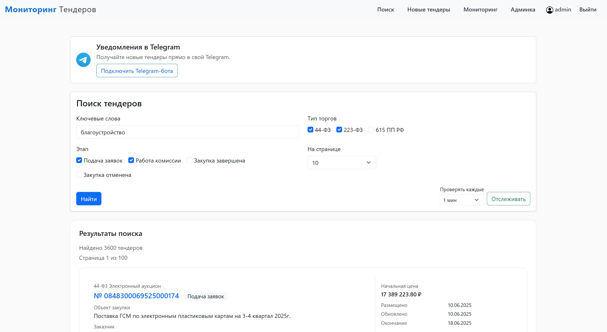

# Tender Monitoring



**Tender Monitoring** is a web application built with Spring Boot for searching and tracking government procurement
notices from the [zakupki.gov.ru](https://zakupki.gov.ru) portal. The service allows you to search tenders by keywords,
subscribe to new announcements, and receive notifications via a Telegram bot

## Features

- Search tenders by keywords, trade types, and placement stages
- Monitor new tenders with specified keywords at a set interval
- View found tenders in the web interface
- Receive notifications about new tenders through the Telegram bot

## Technologies

- Java 21, Spring Boot 3
- Spring MVC, Spring Security, Spring Data JPA
- Thymeleaf and Bootstrap 5.3
- Liquibase
- MapStruct, Jsoup, Rome (RSS)
- PostgreSQL 16
- Telegram Bots API

## Building the project

  ```bash
    ./gradlew clean bootJar
  ```

The resulting jar will appear in build/libs

## Running with Docker Compose

Before launching, specify these environment variables (in a .env file or via the environment):

- `POSTGRES_DB` – database name
- `POSTGRES_USER` and `POSTGRES_PASSWORD` – PostgreSQL credentials
- `DB_URL` – JDBC‑URL like `jdbc:postgresql://db:5432/<database_name>`
- `TELEGRAM_BOT_TOKEN` – your Telegram bot token
- `SPRING_PROFILES_ACTIVE` – Spring profile

Start the service:

  ```bash
    docker compose up --build
  ```

Once running, the web interface will be available at [http://localhost:8080](http://localhost:8080)

## Working with the Telegram bot

1. Start the Telegram bot and send the `/start` command
2. Enter your web application login and password
3. After successful authorization, you will begin receiving notifications about new tenders